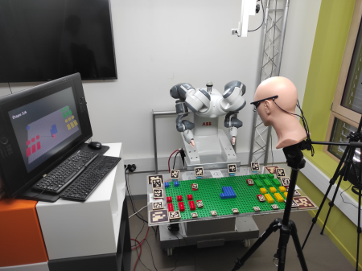
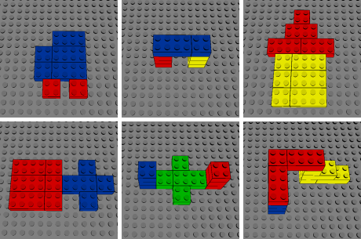
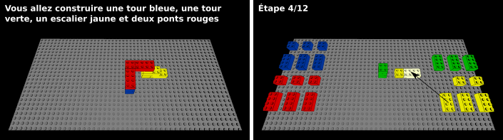

# GAIPAT: Dataset on Human Gaze and Actions for Intent Prediction in Assembly Tasks


gitlab: https://gricad-gitlab.univ-grenoble-alpes.fr/eyesofcobot/gaipat

> The complete ACM datasheet is available [here](datasheet.md)
## Description

This project contains a dataset of oculometric data obtained during figure assembly using [Lego Duplo](https://www.lego.com/fr-fr/themes/duplo?consent-modal=show&age-gate=grown_up).

This dataset was built to study the ocular behavior of human operators during assembly tasks, with the aim of predicting future actions of a human operator in the context of human-cobot collaboration.

## Data Acquisition

### Objective

The aim of this study is to evaluate the performance of different eye movement measurement devices for intent predictions during assembly tasks in a simulated industrial context. Assembly tasks are simulated by building simple structures with Lego Duplo blocks. Our study focuses on the accuracy obtained with each device.

### Experimental Setup & Materials

The workspace consists of two main components: an assembly table and an instruction screen. The assembly table includes a green plate with a central assembly area and storage sections for construction blocks on either side. The blocks (Lego Duplo) are organized by color (blue, red, yellow, or indigreen) and shape (cube or brick) to facilitate easy identification, mirroring industry-standard workspaces.



Participants performed assembly tasks in both sitting and standing positions to cover a broad range of industrial scenarios. The table height was adjusted for each participant in accordance with the European ergonomic standard ISO-14738.

Participants were unfamiliar with the specific assemblies they needed to complete, which were communicated to them through an instruction screen. This screen, positioned next to the table, is operated via buttons located underneath to avoid disrupting the assembly process.

Two different eye-tracking configurations were used in the dataset to record human gaze:

1. ***Remote configuration:*** In this setup, devices are positioned at various locations within the participant’s workspace. We used the [Fovio FX3](https://www.eyetracking.com/fx3-remote-eye-tracking/) and the [Tobii 4C](https://help.tobii.com/hc/en-us/sections/360001811457-Tobii-Eye-Tracker-4C). The Fovio FX3 tracked eye movements on the table. We selected this remote eye-tracker for its ability to monitor horizontal areas, unlike most devices designed for vertical screens. According to Fovio’s documentation, it is positioned at the bottom of the table to avoid eyebrow occlusion and ensure effective calibration. However, user arm movements may obstruct tracking. Data from the Fovio FX3 were recorded using [Fovio’s Eyeworks software](https://www.eyetracking.com/eyeworks-software/). The Tobii 4C --upgraded with an 'analytical use' license-- tracked eye movements on the instruction screen. Initially designed for gaming, the Tobii 4C is less accurate than other Tobii models but is more tolerant of head movement and supports a greater distance between the tracker and participants. Tobii 4C data were collected using custom Python scripts.
2. ***Head-mounted configuration:*** In this setup, participants wore [Pupil Labs Core eye-tracking glasses](https://pupil-labs.com/products/core), equipped with a scene camera above the right eye and two infrared cameras to measure eye movement. We used [AprilTag](https://github.com/AprilRobotics/apriltag-imgs) markers from the 'tag36h11' family to map the assembly workspace to the scene camera. The [Pupil Labs Capture software](https://docs.pupil-labs.com/core/software/pupil-capture/) was used for scene mapping, device calibration, and data collection.

### Participants

We recruited 80 psychology students who volunteered to participate in the study, divided into four groups of 20 based on the remote and head-mounted configurations, with participants either standing or sitting. No personal data (e.g., gender, age, health) was collected. Participants were compensated with experience points for their semester exams. The inclusion criteria required participants to be able to read and understand instructions in French and physically move construction blocks. Since the tasks could be performed while either sitting or standing, the ability to stand was not a criterion for inclusion.

### Procedure

Participants performed assembly tasks while their eyes and hands movements were tracked by various sensors. The difficulty of the figures was varied by adjusting the number of construction blocks used, as well as by incorporating both 2D and 3D figures.



Instructions for assembling these figures were displayed on a separate screen. The experimental procedure was the same for all participants and figures:

1. The eye-tracking device was calibrated and the calibration validated. If calibration quality was insufficient, this step was repeated. Manufacturer's calibration and validation guidelines were followed. In cases where calibration could not be achieved, the experiment continued, but data were not recorded. For each task, eye movements were measured both on the assembly table and the screen. In the remote configuration, two devices were used and calibrated: one for the screen and one for the table.
2. The participant's first instruction appeared on the screen, providing the context and showing the figure to be assembled. The experimenter placed the first construction block, and the remaining blocks were placed by the participant.
3. At each step, a visual instruction indicated which construction block to pick up and where to place it in the assembly. The instructions were structured such that, for each step, the block to be moved and its destination were highlighted. Additionally, to eliminate any ambiguity, an arrow indicated where to move the block. Each figure required six to twelve steps to complete. Participants advanced through each step by pressing a button located under the table.


The entire procedure took around 5 minutes per figure, or 30 minutes for all the figures. Taking into account the welcoming of the participant, the collection of consent and the explanation of the experiment, the experiment lasted around 50 minutes per participant.

### Software Used for Dataset Generation

The software used for the dataset generation includes:

- **Wearable eye-tracker**: Pupil Capture and Pupil Player software, version 3.5, GPL (https://docs.pupil-labs.com/core/)
- **Remote eye-tracker**: EyeWorks software, version 3.30, an EyeTracking proprietary software, with Scene Camera and FaceKit modules (https://www.eyetracking.com/eyeworks-software/).

Data collection was performed during the 2023-24 winter. We will include these details, along with the relevant licensing information, in the updated README file.

### Specifications for Table, Light, and Screen

- **Screen** (Dell P2416D): 52.7x29.6 cm (2560x1440 pixels)
- **Plexiglass support table**: 100x50 cm
- **LEGO assembly surface**: 76x38 cm

### Demonstration

> This video demonstrates the process of collecting eye-tracking data for the GAIPAT dataset, using a head-mounted eye tracker. It is important to note that this demonstration features an experimenter, not one of the study participants. The experimenter assembles the 'Car' figure, filmed from two different camera angles, while the eye data is captured using infrared cameras integrated into the eye tracker. The Pupil Capture software is used to record eye movements, and a screen capture of the software shows the scene being filmed, with a pink dot representing the gaze point, along with the control buttons. The assembly instructions for the figure are also visible in the video. Please note that for participants, no videos of the face, eyes, or body (except for the hands) were recorded, ensuring anonymity and data confidentiality.


## Dataset

The file structure is as follows:

```
├── setup
│   ├── blocks.csv
│   ├── participants.csv
│   ├── glasses.csv
│   ├── instructions_{car,tb,house,tc,sc,tsb}.csv
│   └── slides_{car,tb,house,tc,sc,tsb}.csv
│              
├── participants
│   └── participant_id_XXX
│         ├── table
│         │   ├── gazepoints.csv
│         │   ├── states.csv
│         │   └── pupil_infos.zip
│         └── screen
│             ├── gazepoints.csv
│             ├── states.csv
│             └── pupil_infos.zip
├── README.md
```

The dataset designed for this study comprises data collected before and after the assembly of figures by participants. It is structured into two main categories: general data and assembly-specific data.

### Setup Data

The setup data is located in the `setup` directory. It includes information collected before the figure assembly. The main files are:

- `blocks.csv`: Contains descriptions of the blocks.
- `instructions_{figure_name}.csv`: Provides instructions for assembling each figure.
- `slides_{figure_name}.csv`: Describes the slides used during the figure assembly.
- `participants.csv`: Contains descriptions of the participants.
- `glasses.csv`: Lists the distribution of glasses and contact lenses worn by participants.

#### Details of the Participants Data Files

- `blocks.csv`
  - `id`: Block ID [0, …, 23]
  - `color`: Block color [blue, red, green, yellow]
  - `shape`: Block shape [cube, brick]

- `instructions_{figure_name}.csv`
  - `id`: Instruction ID [0, …, n]. Instruction 0 was done by the experimenter.
  - `block`: Block ID to move.
  - `origin_[$(x_0, y_0), …, (x_3, y_3), level]`: Corners position, from the top left to the bottom left, before moving the block and the level, if previous instructions were correctly followed.
  - `destination_[$(x_0, y_0), …, (x_3, y_3), level]`: Corners position, from the top left to the bottom left, after moving the block and the level, if the instruction was correctly followed.

  Positions are relative.

- `slides_{figure_name}.csv`
  - `id`: Slide number [0, …, n].
  - `title_[$(x_0, y_0), …, (x_3, y_3)]`: Corners position, from the top left to the bottom left, of the title AOI, i.e., the top instruction AOI.
  - `block_[$(x_0, y_0), …, (x_3, y_3)]`: Corners position, from the top left to the bottom left, of the block to grasp AOI.
  - `destination_[$(x_0, y_0), …, (x_3, y_3)]`: Corners position, from the top left to the bottom left, of the block destination AOI.
  - `figure_[$(x_0, y_0), …, (x_3, y_3)]`: Corners position, from the top left to the bottom left, of the figure AOI. The figure AOI is the area where all the moved blocks and the destination of the block to move are located.
  - `arrow_[$(x_0, y_0), …, (x_3, y_3)]`: Corners position, from the top left to the bottom left, of the arrow AOI.

  Positions are relative.

- `participants.csv`
  - `id`: Participant ID.
  - `setup`: [remote, head mounted].
  - `position`: [sitting, standing].
  - `pupil, fovio, tobi`: Calibration score [impossible, severe issues, slight issues, no issue] if applicable, NA otherwise. Qualitative data obtained via experimenter observations.
  - `figure_name`: Data recorded [1: recorded, 0: not recorded].

- `glasses.csv`
  - `setup`: [remote, head mounted].
  - `position`: [sitting, standing].
  - `glasses`: Number of participants wearing glasses [0, …, n].
  - `no_glasses`: Number of participants not wearing glasses [0, …, n].


### Participants Data

The participants data are located in the `participants/[participant_id]` directory. It is subdivided into two subdirectories for each figure:

- `participants/participant_id/figure_name/table`
  - `gazepoints.csv`: Gazepoints on the table.
  - `events.csv`: Events on the table.
  - `states.csv`: Table state.
  - `pupil_info.csv`: Pupil size and data confidence reported by the eye tracker.

- `participants/participant_id/figure_name/screen`
  - `gazepoints.csv`: Gazepoints on the screen.
  - `events.csv`: Events on the screen (Buttons).
  - `states.csv`: Screen state.
  - `pupil_info.csv`: Pupil size and data confidence reported by the eye tracker.

#### Details of Assembly Data Files

  - `gazepoints.csv`
    - `timestamp`
    - `(x, y)`: Gazepoint coordinates.

    Data from different eye trackers have been standardized. Only the "both eye" gazepoint is retained because not all eye trackers can retrieve gazepoints for both eyes separately (Pupil). Where only "separate" gazepoints are provided (Fovio, Tobii), the "both eye" gazepoints have been calculated according to the manufacturer's recommendations. The data has been filtered according to the documentation of the various eye trackers. In the case of measurements without data: NaN was reported.

  - `pupil_info.csv`
    - `timestamp`
    - `{right, left}_diameter`: Right and left pupil diameter.
    - `confidence`: The confidence index. These indices are not comparable across different eye trackers.
    - For head mounted data, only a global confidence index is provided. For remote data, both left and right eye confidences are provided.

  - `events.csv`
    - On the table:
      - `timestamp`
      - `event`: [start, grasp, release, end]
      - `block`: Block ID

      The work zone, i.e., the location of the origin and/or destination of the manipulated block, can be found in the `state.csv` table, so this information is not duplicated here.

    - On the screen:
      - `timestamp`
      - `event`: [start, next, previous, end]

      Note: start and end events are identical on the table and on the screen.

  - `states.csv`
    - On the table:
      - `timestamp`
      - For each block: `(x_0, y_0), …, (x_3, y_3), level, held` Corners positions, level, and a boolean indicating if the block is held by the participant.

    - On the screen:
      - `timestamp`
      - `id`: slide number.

      The elements present on the screen are described in the `setup/slides_{figure_name}.csv` table, so there is no need to duplicate the information here.

## Data Reproducibility

1. Raw data provided by eye trackers and use to compile this dataset are publicaly available on [gitlab](https://gricad-gitlab.univ-grenoble-alpes.fr/eyesofcobot/gaipat_rawdata)
2. Scripts used to compile participants data are publicaly available at on [gitlab](https://gricad-gitlab.univ-grenoble-alpes.fr/eyesofcobot/gaipat_builder)

## Ethical Considerations

This experimental protocol was submitted to and validated by CERGA, the Grenoble Alpes University ethics committee, and received the favorable opinion CERGA-Avis-2023-32.

## Authors and acknowledgment

This dataset is a part of the LIG-SIC Eyes-Of-Cobot Project.
- Maxence Grand, Maxence.Grand@univ-grenoble-alpes.fr, Université Grenoble Alpes, Laboratoire d'Informatique de Grenoble, Teams Marvin/M-PSI
- Damien Pellier, Damien.Pellier@univ-grenoble-alpes.fr, Université Grenoble Alpes, Laboratoire d'Informatique de Grenoble, Team Marvin
- Francis Jambon, Francis.Jambon@univ-grenoble-alpes.fr, Université Grenoble Alpes, Laboratoire d'Informatique de Grenoble, Team M-PSI

## Maintenance \& Contact
For questions or more information, please contact:
- Maxence Grand
- Maxence.Grand@univ-grenoble-alpes.fr
- Université Grenoble Alpes, Laboratoire d'Informatique de Grenoble, Teams Marvin/M-PSI

## License
This project is under the GNU LGPL 2.1 license.
